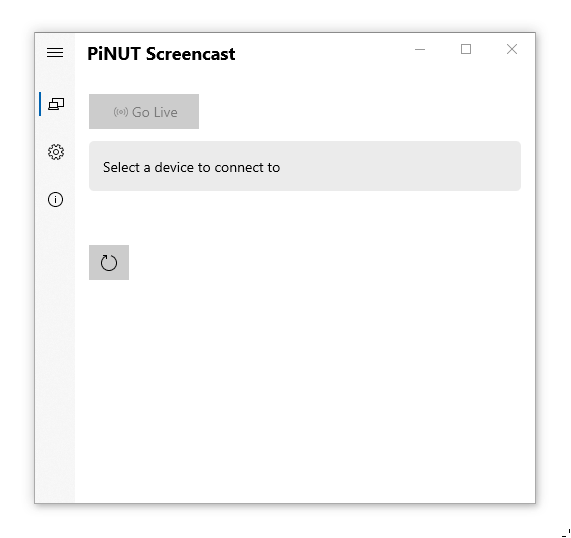

## PiNUT Screencast
Is a screencasting software, that discover devices on the network advertising their services, with emphasis on ease of use and low latency.  
It`s designed to be a alternative to miracast using general purpose hardware like a single-board computer and be tuneable for the use case.



The initial commit is to be considered an alpha
* No sound support
* Needs testing on Windows 11
* Docked menu panel flickers sometimes when streaming

##### Short term roadmap  
* Implement sound support
* Implement more streaming profiles

##### Internationalization
* English
* Swedish

##### Supported Os
* Windows 10 x64 1903 or later

[](https://www.microsoft.com/store/apps/9P5H0TKQTMTS)

------------

### Configure a device
A device needs a Bonjour/mDNS service and mediaplayer listening on the advertised port, txt-records are used to advertise supported parameters.

##### Example configuration using avahi /etc/avahi/services/ptpsink.service
```xml
<?xml version="1.0" standalone='no'?><!--*-nxml-*-->
<!DOCTYPE service-group SYSTEM "avahi-service.dtd">
<service-group>
<name replace-wildcards="yes">Store [Samsung 40"]</name>
<service>
<type>_ptpsink._tcp</type>
<port>2000</port>
<txt-record>pixel_format=yuv420p</txt-record>
<txt-record>resolution=1280X720</txt-record>
<txt-record>framerate=30</txt-record>
<txt-record>container=nut</txt-record>
<txt-record>format=h264</txt-record>
</service>
</service-group>
```
<br/>

| Param | Available         | Description                                                     | 
| ------- | --------------- | --------------------------------------------------------------- |
| name    |                 | Description of the service                                      |
| port    |                 | A free port                                                     |
| type    | _ptpsink._tcp   | Point-to-Point stream over tcp, only supported protocol for now |


<br/>

| txt-record   | Default       | Available        | Description      |
| -------------| ------------- | ---------------- | ---------------- |
| pixel_format | yuv420p       | yuv420p, yuv444p | FFmpeg "pix_fmt" |
| resolution   | 1920X1080     |                  | Max resolution   |
| framerate    | 30            |                  | Max framerate    |
| container    | nut           | nut              | Stream container |
| format       | h264          | h264             | Video format     |

<br/>

Mediaplayer scripts, for documentation on hardware acceleration see your platform.  
Linux
```shell
#!/bin/sh
while true; do
mpv --no-terminal --fs --ontop --cursor-autohide=always --keep-open=no  --profile=low-latency --no-cache --untimed tcp://0.0.0.0:2000?listen
done
```
```shell
#!/bin/sh
#Piping from ncat results in lower latency
while true; do
ncat -l -w 1 -p 2000 | ffplay -loglevel panic -nostats -flags low_delay -probesize 32 -analyzeduration 0 -autoexit -
done
```
Windows
```shell
@echo off
:loop
mpv.exe --no-terminal --fs --ontop --cursor-autohide=always --keep-open=no  --profile=low-latency --no-cache --untimed tcp://0.0.0.0:2000?listen
goto loop
```
```shell
@echo off
rem Piping from ncat results in lower latency
:loop
ncat.exe -l -w 1 -p 2000 | ffplay.exe -loglevel panic -nostats -flags low_delay -probesize 32 -analyzeduration 0 -autoexit -
goto loop
```

------------

### Complete device setup

#### Raspberry Pi4 Model B running Raspberry Pi OS with desktop (32-bit)
`sudo nano /boot/config.txt`
```shell
dtoverlay=cma,cma-size=402653184
dtoverlay=vc4-kms-v3d
```
`sudo reboot`

Install the following packages  
`sudo apt-get install mpv unclutter xdotool`

Verify hardware acceleration is working  
`mpv --hwdec=v4l2m2m --hwdec-codecs=all https://jell.yfish.us/media/jellyfish-3-mbps-hd-h264.mkv`

You should see the in the output:  
Using hardware decoding (v4l2m2m)

Create a script for the ptpsink service  
`touch ~/ptpsink.sh && chmod +x ~/ptpsink.sh && nano ~/ptpsink.sh`
```shell
#!/bin/bash
#Minimize our selfs
sleep 1 && xdotool search "ptpsink.sh" windowminimize
while true; do
/usr/bin/mpv --fs --ontop --keep-open=no --hwdec=v4l2m2m --hwdec-codecs=all --profile=low-latency --no-cache --untimed tcp://0.0.0.0:2000?listen
done
```
<br/>

Create a custom autostart  
<i>In my configuration im also starting a libreoffice slideshow fullscreen, when the device recieves a stream the video will be displayed ontop of the slideshow.</i>

`nano ~/.config/lxsession/LXDE-pi/autostart`

```shell
@lxpanel --profile LXDE-pi
@pcmanfm --desktop --profile LXDE-pi
@unclutter -idle 5
@xset s noblank
@xset -dpms
@xset -s off
@lxterminal -e ~/ptpsink.sh
```
Restart your X session

Create a service file for avahi  
`sudo nano /etc/avahi/services/ptpsink.service`
```shell
<?xml version="1.0" standalone='no'?><!--*-nxml-*-->
<!DOCTYPE service-group SYSTEM "avahi-service.dtd">
<service-group>
<name replace-wildcards="yes">Livingroom [Samsung 40"]</name>
<service>
<type>_ptpsink._tcp</type>
<port>2000</port>
<txt-record>framerate=30</txt-record>
<txt-record>pixel_format=yuv420p</txt-record>
<txt-record>resolution=1920X1080</txt-record>
<txt-record>container=nut</txt-record>
<txt-record>format=h264</txt-record>
</service>
</service-group>
```

`sudo systemctl restart avahi-daemon`

The Raspberry Pi should now be disoverable by PiNUT Screencast and ready to recieve a stream.

Credits
------------
This software uses the following libraries  
Zeroconf https://github.com/novotnyllc/Zeroconf
